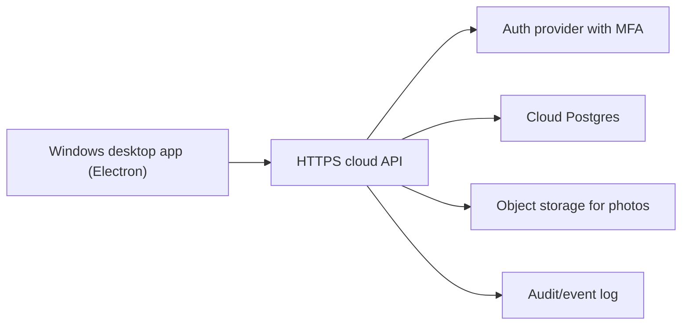

# CFlow desktop + cloud architecture

## Target shape

## Why not direct desktop to database

Do not place a Postgres connection string or Supabase service-role key inside a Windows app. A desktop binary can be unpacked, memory can be inspected, and traffic can be observed. The safe model is a desktop client with user tokens, calling a server API that applies permissions and writes to the database.

## Data domains

- `users`: staff, roles, branch access, device trust.
- `clients`: phone, Telegram, comments, history.
- `boxes`: id, track, weight, dimensions, photos, status, location, responsible user.
- `warehouse_locations`: warehouse, rack, shelf, cell, capacity.
- `shipments`: container, car, air, date, weight, cost, box list.
- `ledger_entries`: payments, debts, income, expenses, reversals.
- `audit_events`: immutable history for every action.

## Roles

- Operator: receive boxes, create clients, add photos, assign storage.
- Warehouse: move boxes, change operational status, prepare issue.
- Manager: reports, analytics, shipment overview.
- Finance: payments, debts, ledger corrections.
- Admin: users, roles, settings, tariffs, branch setup.

## API rules

- All requests require a signed user token.
- Every mutation validates the user's role and branch.
- Financial totals are calculated on the server.
- Audit events are written in the same transaction as the business change.
- Photo uploads use short-lived signed URLs.
- Search runs against indexed fields and normalized tokens.

## Desktop release rules

- Package only the UI shell and public config.
- Store tokens in the OS credential vault, not in plain files.
- Use Windows code signing.
- Disable devtools in production.
- Keep auto-updates signed.
- Pin allowed API origins.
